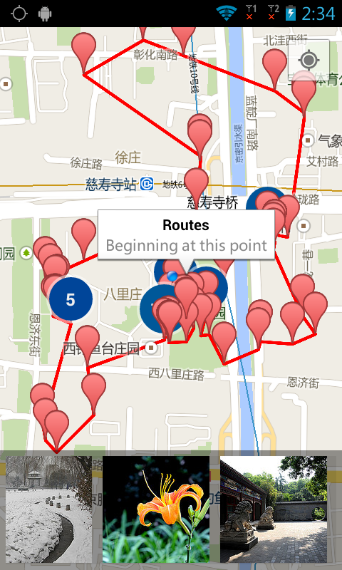

TouristHelper
=========




Usage
--------
```
cd TouristHelper
./gradlew iD
```
Changes
--------
Used greedy 2-opt algorithm to improve the route result,
The new route is about 30% shorter than the previous one calculated by greedy
algorithm.
However, greedy 2-opt requires to calculate total distance of the route very
frequently, and the performance is much worse than before and than expected.
The main reason is the Location.distanceBetween method are been called too many times.
I am working on improving the performance.

Known issues
--------
* Tested on Samsung Galaxy S2.
* You might see photos of different topics, not only sights to see, as flickr
  doesn't support such filter at the moment.
* Yahoo has been calling for talents
  to attend its "image classification challenge".
  http://acmmm13.org/submissions/call-for-multimedia-grand-challenge-solutions/yahoo-large-scale-flickr-tag-image-classification-challenge/
* The app icon is from google images search.