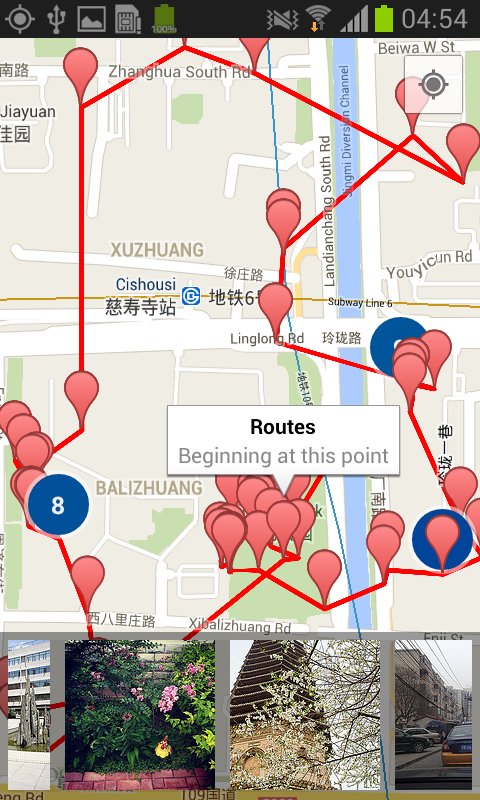

TouristHelper
=========




Usage
--------
```
cd TouristHelper
./gradlew iD
```

Known issues
--------
* Tested on Samsung Galaxy S2.
* You might see photos of different topics, not only sights to see, as flickr
  doesn't support such filter at the moment.
* Yahoo has been calling for talents
  to attend its "image classification challenge".
  http://acmmm13.org/submissions/call-for-multimedia-grand-challenge-solutions/yahoo-large-scale-flickr-tag-image-classification-challenge/
* The app icon is from google images search.