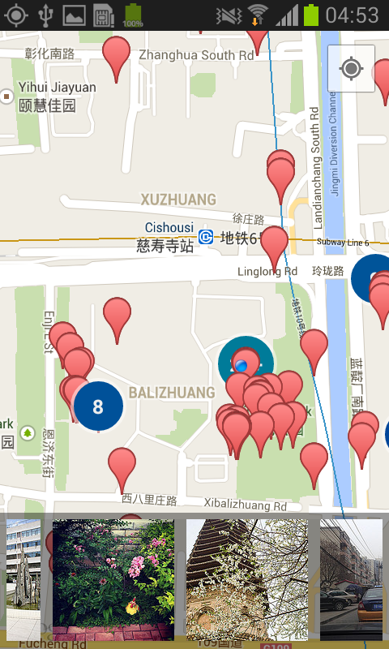

TouristHelper
=========




Usage
--------
```
cd TouristHelper
./gradlew iD
```

Known issues
--------
* Tested on Samsung Galaxy S2.
* Images loaded are not only sights, currently there is no api to filter sights only images.
* The icon is from google images search.